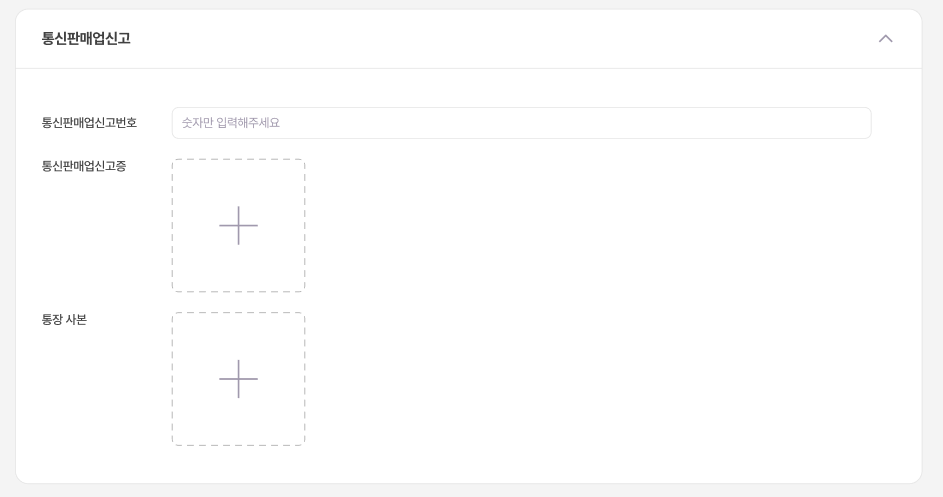
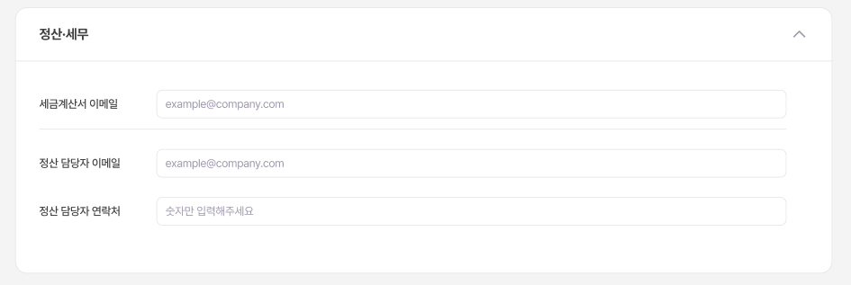
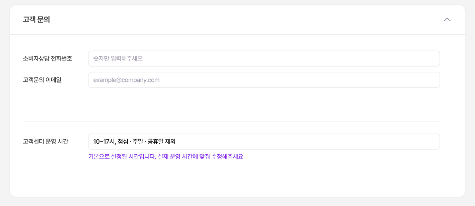

# 🏢 판매자 정보 설정

사업자 정보와 정산 정보를 등록해야 판매를 시작할 수 있어요!

***

## 📍 접속 경로

**셀러정보 관리** → **판매자 정보**

***

## 📋 등록 항목

### 1️⃣ 사업자등록 정보

> 💡 이미지는 **JPG, PNG** 형식으로, 글자가 선명하게 보이도록 올려주세요.

***

### 2️⃣ 통신판매업신고

<figure><figcaption></figcaption></figure>

> ⚠️ **통장 사본 주의**
>
> * 개인사업자: 대표자명 = 예금주명
> * 법인사업자: 법인명 = 예금주명
> * 계좌번호, 예금주명이 선명해야 해요! 정보가 잘 보이지 않을 경우 반려가 될 수 있습니다.

***

### 3️⃣ 정산 세무

<figure><figcaption></figcaption></figure>

> 💡 세금계산서 받을 이메일 주소를 정확히 입력해주세요.

***

### 4️⃣ 고객 문의

<figure><figcaption></figcaption></figure>

> 💡 소비자상담 연락처는 상품 상세 페이지에 노출돼요.
>
> 고객센터 운영시간 기본값: 10\~17시 (점심/주말/공휴일 제외)

***

## ✏️ 정보 수정

1. **셀러정보 관리** → **판매자 정보**
2. 수정할 항목 변경
3. **저장** 클릭

> ⏱️ 수정 후 **2-3영업일** 검토 시간이 필요해요.

***

## ➡️ 다음 단계

[배송 정보 설정](../products/shipping-settings.md)을 진행해주세요!
