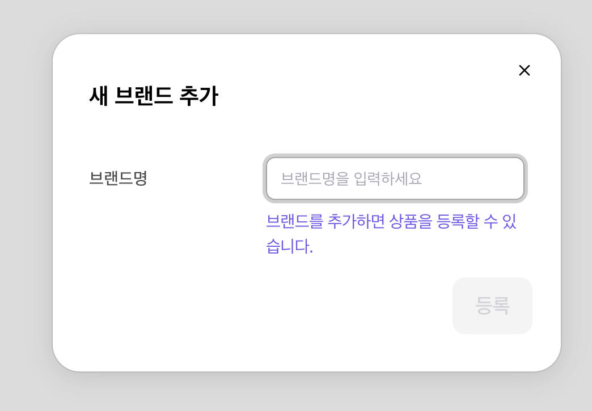

# 🏷️ 브랜드 추가

상품 등록 전에 브랜드를 먼저 추가해주세요!

---

## 📍 접속 경로

**상품관리** → **내 상품** → **+ 새 브랜드 추가**

<figure><figcaption></figcaption></figure>

---

## 📝 추가 방법

### 1️⃣ 브랜드 추가 버튼 클릭

상단의 **+ 새 브랜드 추가** 클릭

---

### 2️⃣ 브랜드명 입력

<figure><figcaption></figcaption></figure>

> 💡 공식 브랜드명을 정확히 입력해주세요!
>
> 브랜드가 여러 개면 **+ 새 브랜드 추가**로 추가 등록하세요.

---

### 3️⃣ 등록 버튼 클릭

**등록** 버튼 클릭하면 완료!

---

## 🗂️ 브랜드 관리

상품 목록 상단 탭에서 브랜드별 필터링 가능해요.

---

> ⚠️ **주의**: 브랜드 이름은 수정이 어려우니 정확하게 입력해주세요!

---

## ➡️ 다음 단계

[상품 등록](register.md)을 진행해주세요!
