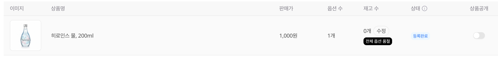
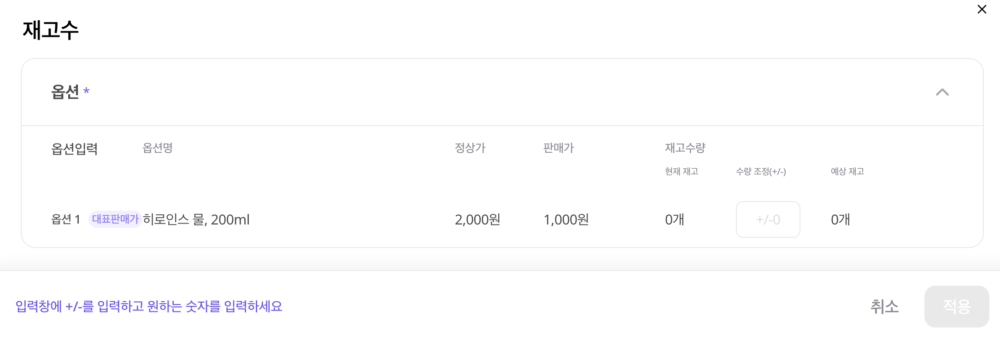
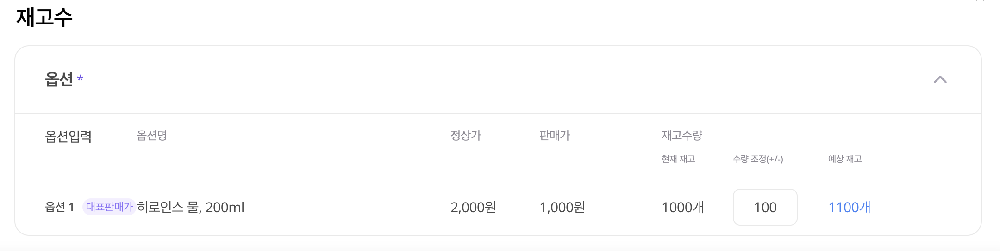
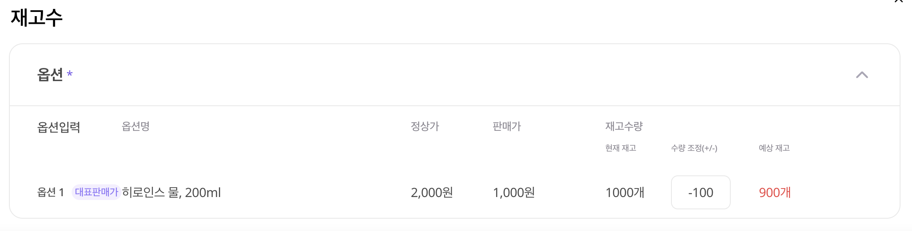

# 📋 상품 목록 관리

등록된 상품을 한눈에 관리해보세요!

---

## 📍 접속 경로

**상품관리** → **내 상품**

---

## 화면 구성

### 브랜드별 탭

상단 탭에서 브랜드별로 상품을 필터링할 수 있어요.

- **전체**: 모든 브랜드 상품
- **브랜드명**: 해당 브랜드만

---

### 상품 테이블

| 컬럼 | 설명 |
|------|------|
| 이미지 | 대표 이미지 |
| 상품명 | 등록된 이름 |
| 판매가 | 실제 판매 가격 |
| 옵션 수 | 등록된 옵션 개수 |
| 재고 수 | 현재 재고 |
| 상태 | 검수 중 / 등록완료 / 판매중지 |
| 상품공개 | 앱 노출 ON/OFF |

---

## 주요 기능

### 1️⃣ 상품공개 설정

**상품공개** 토글로 앱 노출을 제어해요.

| 상태 | 설명 |
|------|------|
| ON | 앱에 노출됨 ✅ |
| OFF | 앱에 미노출 ❌ |

> 💡 판매할 상품은 반드시 **ON**으로 켜주세요!

---

### 2️⃣ 재고 수정

**STEP 1.** 재고 수 수정 클릭

<figure><figcaption></figcaption></figure>

**STEP 2.** 현재 재고 수량 입력

<figure><figcaption></figcaption></figure>

**STEP 3.** 수량 조정 (선택)

- `+100` → 100개 추가
- `-100` → 100개 차감

<figure><figcaption></figcaption></figure>

<figure><figcaption></figcaption></figure>

> ⚠️ 재고가 0이 되면 **품절** 상태가 돼요!

---

다음: [상품 리뷰 확인](reviews.md)
