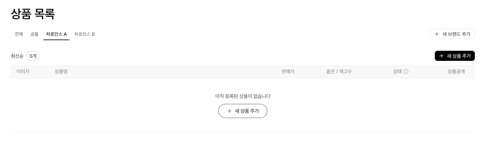
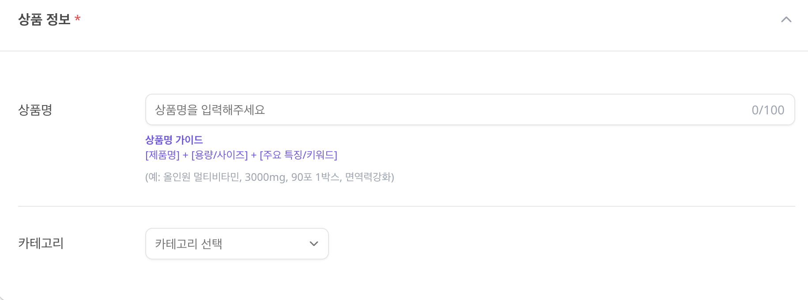
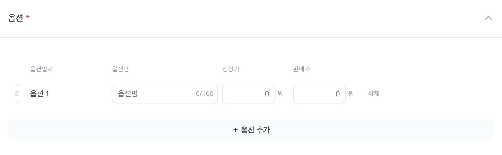
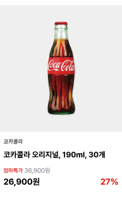

# 📦 상품 등록

판매할 상품을 등록해보세요!

---

## 📍 접속 경로

**상품관리** → **내 상품** → **+ 새 상품 추가**

<figure><figcaption></figcaption></figure>

---

## 📝 등록 단계

### 1️⃣ 상품 정보 입력

<figure><figcaption></figcaption></figure>

> 💡 **상품명 작성 팁**
>
> [제품명] + [용량/사이즈] + [주요 특징]
>
> 예: 올인원 멀티비타민, 3000mg, 90포 1박스, 면역력강화

---

### 2️⃣ 브랜드 선택

<figure><figcaption></figcaption></figure>

> 💡 다른 브랜드로 등록이 필요하면 [브랜드 추가](brand.md)를 먼저 해주세요!

---

### 3️⃣ 옵션 설정

<figure><figcaption></figcaption></figure>

**하나 이상의 옵션 필수!** 사이즈, 색상, 추가 구성 등을 등록하세요.

**옵션명 예시**
- 사이즈: 응원이 티셔츠 L / 응원이 티셔츠 M
- 색상: 응원이 립스틱, 레드오렌지 / 로즈핑크
- 구성: 응원이 과일 세트 / 보자기 포장 추가

> 💡 재고 수정은 상품 등록 및 검수 완료 후 가능해요.

---

### 4️⃣ 기본 판매가 설정

| 항목 | 설명 |
|-----|-----|
| 원가 | 정가 (취소선 표시) |
| 할인가 | 할인 적용 가격 |

> 💡 옵션 중 최저가가 자동 입력돼요.

---

### 5️⃣ 이미지 등록

#### 대표 이미지

<figure><figcaption></figcaption></figure>

- 비율: **1:1 정사각형**
- 형식: JPG, PNG

> ⚠️ **이미지 주의사항**
> - 배경에 상품만! (워터마크, 텍스트 X)
> - 타사 로고 노출 금지
> - 실제 상품과 동일한 고품질 이미지
> - 상품은 중앙에 배치

#### 상세 이미지

상품 하단에 들어갈 이미지를 순서대로 올려주세요.

- 비율: 1:1 정사각형
- 형식: jpg, png, gif

---

### 6️⃣ 인증 정보 / 정보제공고시

> ⚠️ 안전인증 대상 상품(전기용품, 어린이제품 등)은 인증정보 필수!

품목 선택 후 필수 정보를 입력하세요. 상세페이지에 있으면 "상세페이지 참조" 선택.

---

### 7️⃣ 저장

모든 정보 입력 후 **저장**하면 완료!

---

## ➡️ 다음 단계

[상품 목록 관리](list.md)에서 등록된 상품을 확인하세요!
