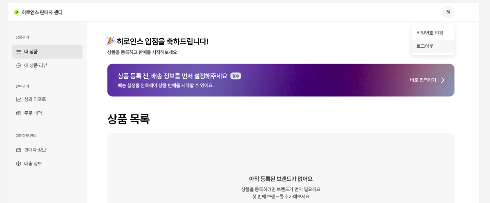
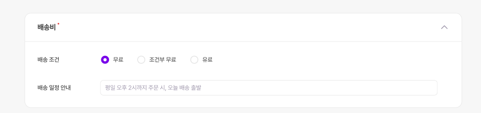

# 🚚 배송 정보 설정

배송 정보를 입력해야 상품을 판매할 수 있어요!

---

## 📍 접속 경로

- 입점 시: **[배송 정보를 먼저 설정해주세요]** → **바로 입력하기**
- 또는: **셀러정보 관리** → **배송 정보**

<figure><figcaption></figcaption></figure>

---

## 📋 설정 항목

### 1️⃣ 배송비

<figure><figcaption></figcaption></figure>

| 유형 | 설명 |
|-----|-----|
| 무료 | 모든 주문 무료 |
| 유료 | 고정 배송비 |
| 조건부 무료 | 일정 금액 이상 무료 (예: 15,000원 이상) |

> 💡 **팁**: 무료배송이 구매 전환율이 높아요!

---

### 2️⃣ 반품 및 교환

| 항목 | 내용 |
|-----|-----|
| 반품 배송비 (편도) | 고객 변심 반품 시 |
| 교환 배송비 (왕복) | 교환 시 왕복 비용 |
| 반품/교환지 주소 | 상품 받을 주소 |
| 반품/교환 조건 | 수령 후 7일 이내, 미개봉/미사용 |

> ⚠️ **참고**
> - 법적으로 상품 수령 후 7일 이내 단순 변심 반품 가능
> - 반품/교환 발생 시 히로인스에서 먼저 확인 후 연락드려요

---

## ✏️ 정보 수정

1. **셀러정보 관리** → **배송 정보**
2. **수정하기** 클릭
3. 항목 변경 후 **저장하기**

---

## ➡️ 다음 단계

[브랜드 추가](brand.md)를 진행해주세요!
