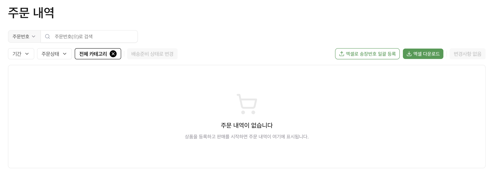

# 📦 주문 내역 확인

주문을 확인하고 관리해보세요!

---

## 📍 접속 경로

**판매관리** → **주문 내역**

---

## 검색 & 필터

<figure><figcaption></figcaption></figure>

| 항목 | 설명 |
|------|------|
| 검색 | 주문번호/송장번호/상품명/옵션명 |
| 기간 | 조회 기간 설정 |
| 주문상태 | 상태별 필터링 |
| 카테고리 | 전체/특정 카테고리 |

---

## 주문 상태

| 상태 | 설명 |
|------|------|
| 결제완료 | 발송 대기 중 |
| 배송준비중 | 상품 준비 및 포장 중 |
| 배송중 | 택배사 배송 진행 중 |
| 배송완료 | 고객 수령 완료 |
| 결제취소 | 주문 취소됨 |
| 반품신청 | 반품 진행 중 |
| 반품완료 | 반품 완료 |

---

## 주요 기능

### 1️⃣ 배송준비 상태로 변경

주문 선택 → **배송준비 상태로 변경** 클릭

> ⚠️ **결제완료 상태**에서는 고객이 주문 취소 가능! 출고 전 반드시 **배송준비중**으로 변경해주세요.

---

### 2️⃣ 엑셀 다운로드

**엑셀 다운로드** 클릭 → 현재 필터링된 주문 목록 저장

---

### 3️⃣ 송장번호 일괄 등록

👉 [송장번호 등록](shipping.md) 참고

---

### 4️⃣ 변경사항 저장

> ⚠️ 배송정보 변경 후 반드시 **변경사항 저장** 클릭!

---

## 주문 테이블 컬럼

| 컬럼 | 설명 |
|------|------|
| 통합주문번호 | 고유 주문 식별 번호 |
| 구분 | 일반 / 체험단 |
| 주문자정보 | 이름, 연락처 |
| 주문상품ID | 주문된 상품 고유 ID |
| 상품정보 | 상품명, 옵션명 |
| 판매가 | 상품 판매 가격 |
| 수량 | 주문 수량 |
| 결제금액 | 실제 결제된 금액 |
| 수령인 | 받는 사람 이름 |
| 연락처 | 받는 사람 연락처 |
| 주소 | 배송 주소 |
| 우편번호 | 우편번호 |
| 배송메모 | 고객 요청사항 |
| 결제일시 | 결제 완료 시간 |
| 취소일시 | 취소된 경우 취소 시간 |
| 배송일자 | 배송 처리 일자 |
| 송장번호 | 등록된 운송장 번호 |

---

다음: [송장번호 등록](shipping.md)
