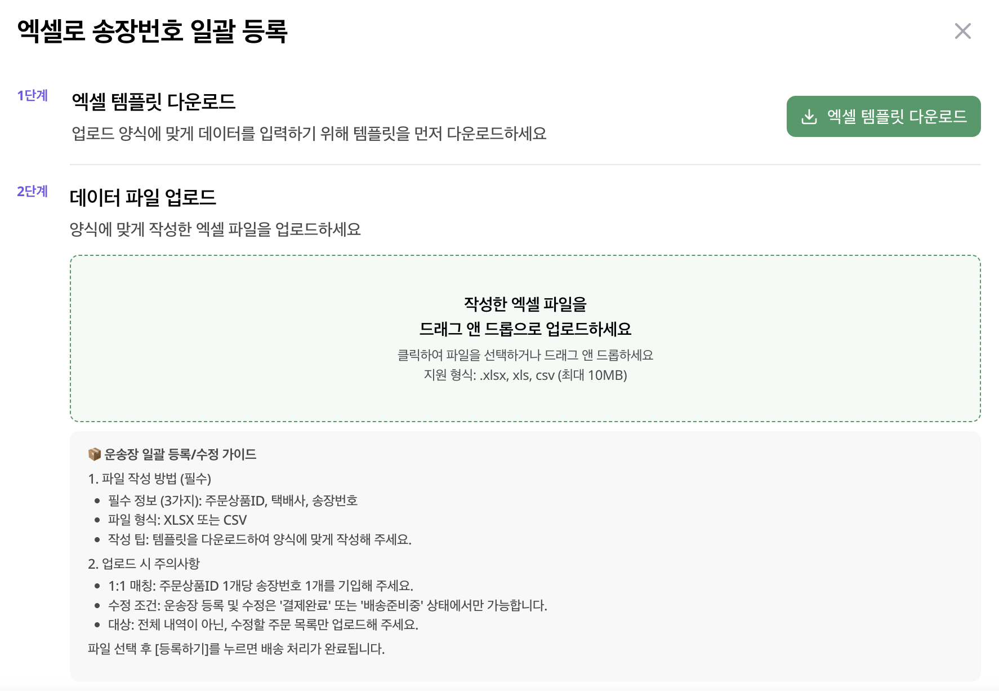

# 🚚 송장번호 등록

주문에 송장번호를 등록해보세요!

---

## 📍 접속 경로

**판매관리** → **주문 내역**

---

## 등록 방법

### 방법 1️⃣ 개별 등록

1. 주문 내역에서 해당 주문 선택
2. 택배사 & 송장번호 입력
3. **변경사항 저장** 클릭

---

### 방법 2️⃣ 엑셀 일괄 등록

여러 주문의 송장번호를 한 번에 등록할 수 있어요!

**STEP 1.** 엑셀 템플릿 다운로드

1. **엑셀로 송장번호 일괄 등록** 클릭
2. **엑셀 템플릿 다운로드** 클릭
3. 파일 저장

**STEP 2.** 템플릿 작성

<figure><figcaption></figcaption></figure>

**필수 입력 정보 (3가지)**

| 항목 | 설명 |
|------|------|
| 주문상품ID | 주문 내역에서 확인 |
| 택배사 | 택배사 이름 |
| 송장번호 | 운송장 번호 |

**STEP 3.** 파일 업로드

1. 작성한 파일 드래그 앤 드롭 (또는 클릭)
2. **등록** 클릭
3. 우측 상단 **저장** 클릭

<figure><figcaption></figcaption></figure>

> 💡 지원 형식: .xlsx, .xls, .csv (최대 10MB)

---

## 업로드 주의사항

| 항목 | 내용 |
|------|------|
| 1:1 매칭 | 주문상품ID 1개당 송장번호 1개 |
| 수정 조건 | "결제완료" 또는 "배송준비중" 상태만 가능 |
| 대상 | 수정할 목록만 업로드 |

> ⚠️ **등록** 버튼 클릭 시 배송 처리가 완료돼요! 송장번호를 정확히 입력해주세요.

---

다음: [반품 관리](returns.md)
